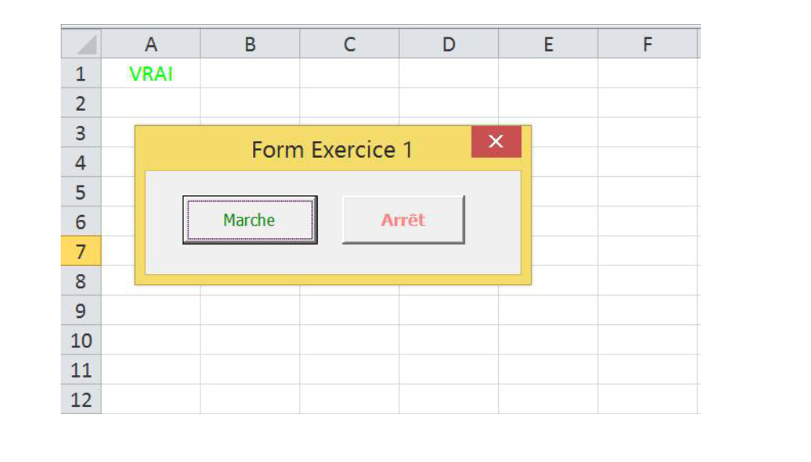
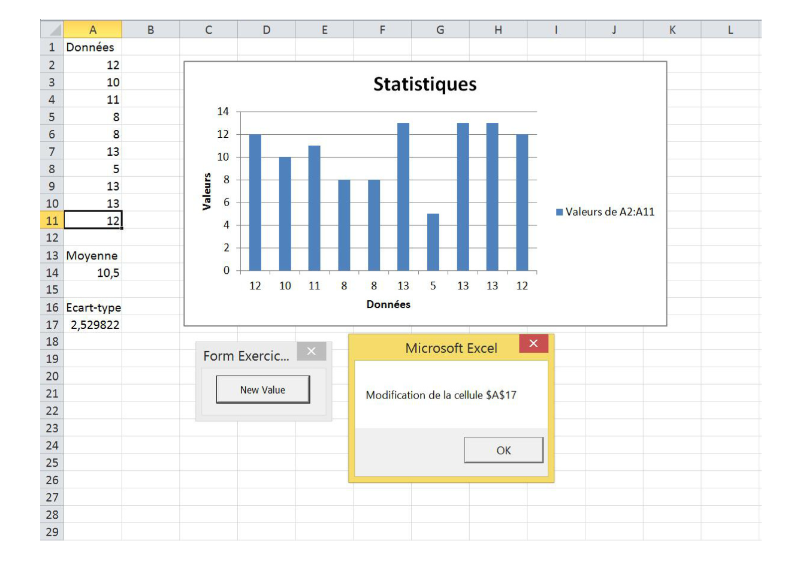
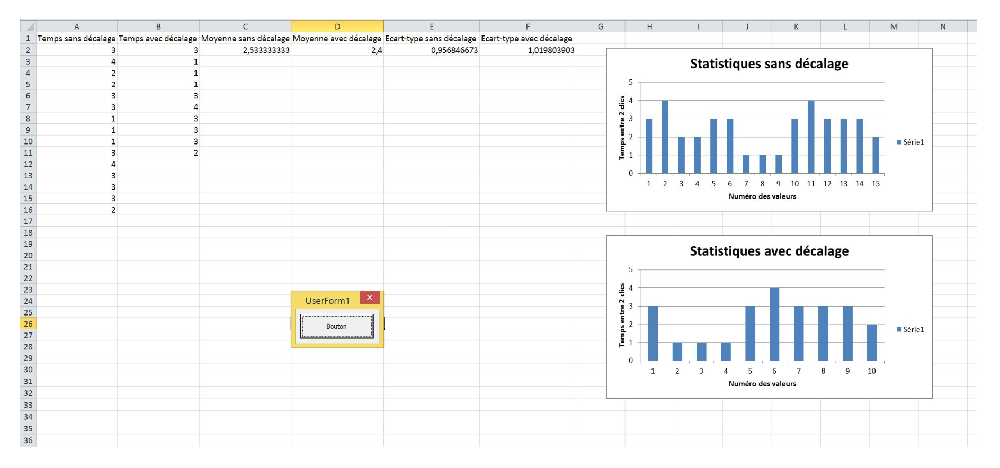
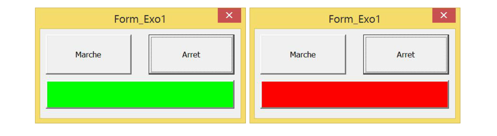
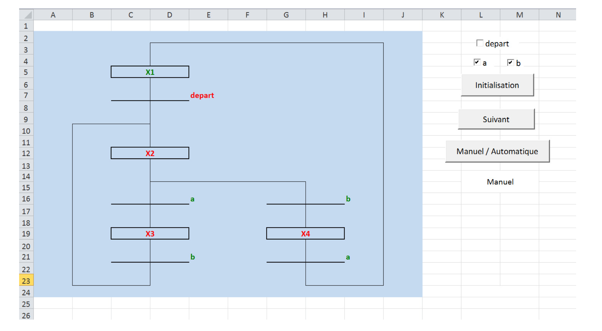

# Bureau d’étude — Supervision sous Excel/VBA (Master SMaRT)

Projet académique de supervision : IHM (UserForms), événements Excel, timers non bloquants, pilotage par Grafcet, et supervision d’un procédé de fabrication avec arrêt d’urgence et historisation.

---

## Fonctionnalités
- IHM de commande Marche/Arrêt avec gestion d’état, verrouillage et retour visuel.
- Acquisition/gestion de données : génération, affichage graphique, calcul moyenne/écart-type, gestion d’événements Excel.
- Timers non bloquants avec `Application.OnTime` (clignoteur).
- Grafcet sous VBA : états, transitions, affichage couleur, mode manuel/automatique.
- Supervision d’un procédé : séquences de fabrication (fraisage/perçage/changement de pièce), indicateurs, arrêt d’urgence avec reprise “temps restant”, sauvegarde d’historique (`save.xls`).

---

## Architecture (vue globale)

```mermaid
flowchart LR
  A[UserForms IHM] --> B[Modules VBA]
  B --> C[Feuilles Excel : données / affichage / graphes]
  B --> D[Timers : Application.OnTime]
  B --> E[Grafcet : états / transitions]
  E --> F[Process de fabrication simulé]
  F --> G[Historisation vers save.xls]

## Aperçu visuel






